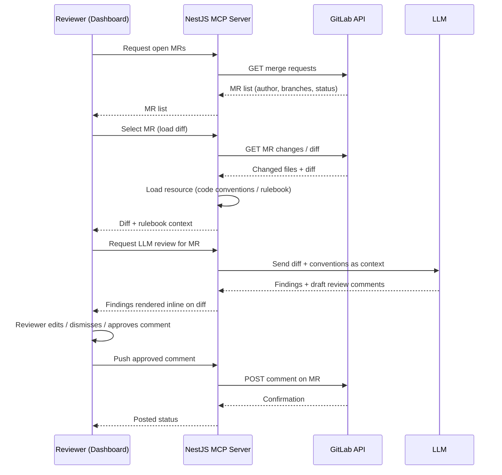
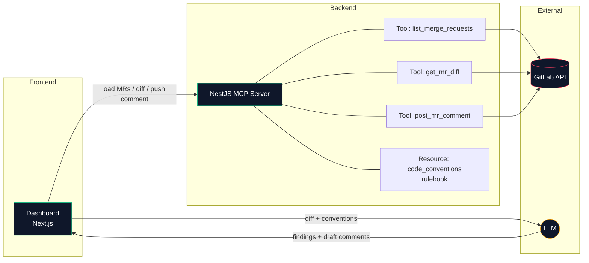

# AI Code Review Dashboard

A dashboard for AI-assisted code review on GitLab merge requests. A local **NestJS MCP Server** sits between this dashboard and GitLab, exposing tools/resources that let an LLM read merge request context and write review comments back — with a human reviewer in the loop the whole time.

## How it works

```
GitLab  <-->  NestJS MCP Server  <-->  LLM  <-->  This Dashboard
```

1. **Load MRs** — the dashboard asks the MCP Server for open merge requests. The MCP Server calls the GitLab API and returns MR metadata (author, branches, status) plus the changed files/diff for a selected MR.
2. **Load context** — the MCP Server also exposes supporting resources the LLM needs to review well, e.g. the team's code convention / compliance rulebook, served as an MCP resource (not hardcoded in the dashboard).
3. **LLM review** — the MR diff + the loaded resources (conventions, rules) are passed to the LLM, which returns findings and a draft review comment per flagged issue.
4. **Human review** — the dashboard shows the LLM's findings inline next to the relevant diff lines. The reviewer can edit the draft comment, dismiss a finding as a false positive, or approve it as-is.
5. **Push back to GitLab** — once approved, the dashboard sends the (possibly edited) comment to the MCP Server, which posts it back to the GitLab MR via the GitLab API.

The dashboard itself holds no GitLab credentials and never calls the GitLab API directly — all of that goes through the MCP Server.

## Architecture / Flow



**Flow summary:**
1. Dashboard never talks to GitLab directly — every request goes through the MCP Server.
2. The MCP Server is the single source of truth for both GitLab data (MRs, diffs) and supporting resources (code conventions, compliance rulebook).
3. The LLM only sees what the MCP Server hands it — diff + context — and returns findings/comments, it never touches GitLab itself.
4. The human reviewer is the last gate before anything is written back to GitLab; the LLM's comment is a draft until pushed.

### System / Component View

The sequence diagram above shows the *order* of calls. This graph shows the *components* and what each one is responsible for:



- **Dashboard** — UI only, no GitLab credentials, no direct GitLab calls.
- **MCP Server** — owns all GitLab access (via its tools) and serves the rulebook/conventions as an MCP resource.
- **GitLab API** — only ever called by the MCP Server's tools, never by the dashboard or the LLM.
- **LLM** — receives diff + conventions from the dashboard (or via the MCP Server, depending on where the review call is orchestrated) and returns findings; has no access to GitLab or any credentials.

## Tech Stack

- [Next.js](https://nextjs.org) (App Router) + TypeScript
- [Tailwind CSS](https://tailwindcss.com)
- [shadcn/ui](https://ui.shadcn.com)
- [lucide-react](https://lucide.dev) icons
- MCP (Model Context Protocol) client, connecting to a local NestJS MCP Server over stdio

## Getting Started

```bash
npm install
npm run dev
```

Open [http://localhost:3000](http://localhost:3000) to view the dashboard.

You'll also need the NestJS MCP Server running locally and reachable over stdio — see that project's own README for setup. Without it, the dashboard has no live MR/GitLab data to show.

### Environment

Set whatever the MCP Server needs to reach GitLab (typically a GitLab personal/project access token and your GitLab instance URL) in the **MCP Server's** environment, not this dashboard's — credentials should never live in the frontend.

## Project Structure

```
app/
  page.tsx                  # renders the dashboard
components/
  code-review/
    mcp-status-bar.tsx      # MCP connection status + manual sync
    mr-sidebar.tsx          # list of open MRs loaded via MCP
    diff-viewer.tsx         # diff + inline LLM findings
    rulebook-checklist.tsx  # code convention / compliance resource, loaded via MCP
    action-panel.tsx        # edit / push / dismiss LLM comment
```

## Key Features

- **MCP Status Bar** — shows live connection state to the MCP Server.
- **MR list** — pulled from GitLab through the MCP Server, with LLM-derived risk status per MR.
- **Diff view with inline LLM findings** — each flagged line shows the LLM's comment directly beneath it, GitLab-thread style.
- **Code convention / rulebook view** — compliance and convention rules loaded as an MCP resource, used as review context for the LLM.
- **Human-in-the-loop action panel** — review, edit, dismiss, or push the LLM's comment back to the GitLab MR.

## Roadmap

- Wire MR list / diff loading to live MCP tool calls (currently mocked)
- Support multiple LLM findings per MR/file
- Error and retry handling for failed pushes to GitLab
- Auth/session for reviewer access

## Learn More

- [Next.js Documentation](https://nextjs.org/docs)
- [Model Context Protocol](https://modelcontextprotocol.io)
- [GitLab API](https://docs.gitlab.com/ee/api/)

## Deploy

The dashboard can be deployed like any Next.js app (e.g. [Vercel](https://vercel.com)). The MCP Server, since it talks to GitLab and runs over stdio, is typically run locally or on infrastructure you control rather than alongside the frontend deployment.